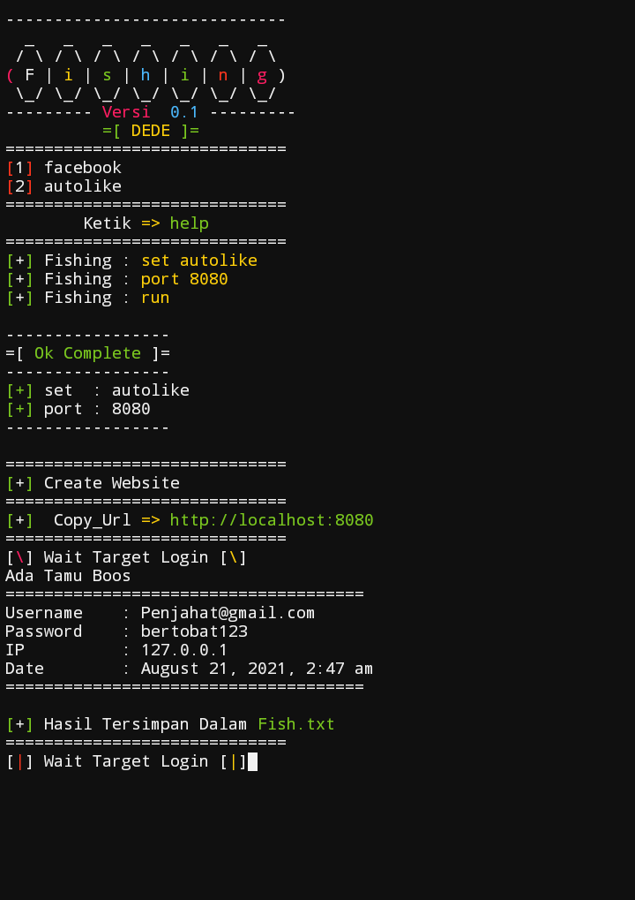

# Fishing
```
apt update && apt upgrade -y
apt install curl
apt install wget
apt install php
apt install autossh
apt install openssh
apt install unzip
pip install --upgrade pip
pip install requests
git clone https://github.com/TermuxArt/Fishing
cd Fishing
unzip Fishing.zip
python fis.py
help
```


# Images

<br>

<br>

